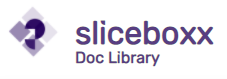

<!-- PROJECT LOGO -->
<br />
<p align="center">
  <a href="https://github.com/Crio-Winter-of-Doing-2021/SLICE-T8">
    
  </a>

  <h3 align="center">With npm package <a href="https://www.npmjs.com/package/slicedoclib">slicedoclib</a></h3>

  <p align="center">
     A document library that supports upload of documents from different data sources such as your device, google drive etc and store it in your AWS s3 bucket.
  </p>
</p>

<br/>
<br/>


<!-- TABLE OF CONTENTS -->
<details open="open">
  <summary><b>Table of Contents</b></summary>
  <ol>
    <li>
      <a href="#about-the-project">About The Project</a>
      <ul>
        <li><a href="#project-architecture">Project Architecture</a></li>
        <li><a href="#built-with">Built With</a></li>
      </ul>
    </li>
    <li><a href="#project-structure">Project Structure</a></li>
    <li>
      <a href="#getting-started">Getting Started</a>
      <ul>
        <li><a href="#prerequisites">Prerequisites</a></li>
        <li><a href="#installation">Installation</a></li>
      </ul>
    </li>
    <li><a href="#library-usage">Library Usage</a></li>
    <li><a href="#roadmap">Roadmap</a></li>
    <li><a href="#contributing">Contributing</a></li>
    <li><a href="#license">License</a></li>
    <li><a href="#contact">Contact</a></li>
  </ol>
</details>
<br/>
<br/>
<!-- ABOUT THE PROJECT -->

# About The Project

<!--- [![Product Name Screen Shot][product-screenshot]](https://example.com) -->

The project will be a library that can be plugged into a web app or an android app as a component. The library integrates with multiple data sources (like digiLocker, Google Drive etc.) and storage services (like S3) and uploads data from these sources to the chosen storage service.

### Project Architecture

<br/>


<br/>

<br/>

### Built With

<!-- This section should list any major frameworks that you built your project using. Leave any add-ons/plugins for the acknowledgements section. Here are a few examples. -->

- [React](https://reactjs.org)
- [Material-UI](https://material-ui.com)
- [Node](https://nodejs.org/en/docs)
- [Express](https://expressjs.com)
  <br/>
  <br/>

<!-- Project Structure -->

# Project Structure

```bash
Backend
   |-- app.js
   |-- controllers
   |   |-- auth.js
   |   |-- getDocs.js
   |   |-- upload.js
   |-- package-lock.json
   |-- package.json
   |-- routes
   |   |-- auth.js
   |   |-- getDocs.js
   |   |-- upload.js
   |
Frontend
   |-- package-lock.json
   |-- package.json
   |-- public
   |   |-- index.html
   |-- src
   |   |-- App.css
   |   |-- App.js
   |   |-- apis
   |   |   |-- Api_S3.js
   |   |   |-- Api_digimocker.js
   |   |   |-- Api_gDrive.js
   |   |   |-- Api_link.js
   |   |-- assets
   |   |-- components
   |   |   |-- AlertDialog.js
   |   |   |-- AuthS3.js
   |   |   |-- CameraSetup.js
   |   |   |-- CardPreview.js
   |   |   |-- DigiMocker.js
   |   |   |-- GoogleDrive.js
   |   |   |-- LinkSetup.js
   |   |   |-- MyDevice.js
   |   |   |-- TabPanel.js
   |   |   |-- camera
   |   |   |   |-- Camera.js
   |   |   |   |-- cameraHelper.js
   |   |   |-- toasts.js
   |   |-- index.js
   |   |-- layout
   |   |   |-- Home
   |   |   |   |-- Home.js
   |   |   |   |-- style.css
   |
sliceDocLib (Here is the Main Library)
   |-- data-sources
   |   |-- digiMocker.js
   |   |-- googleDrive.js
   |   |-- linkSource.js
   |-- index.js
   |-- package-lock.json
   |-- package.json
   |-- storage-services
   |   |-- awsS3.js
```

<br/>

<!-- GETTING STARTED -->

# Getting Started

<br/>
Our main focus on <a href="https://github.com/Crio-Winter-of-Doing-2021/SLICE-T8/">sliceDocLib</a> folder mention in the folder structure. <br/>
<br/>
To get started with we have created a frontend and backend to play with it. This example will help you to setting up your project locally.
<br/>
To get a local copy up and running follow these simple example steps.

<br/>
<br/>

<!-- ### Prerequisites

<br/>
This is an example of how to list things you need to use the software and how to install them.

- npm package install
  ```sh
  npm install slicedoclib
  ```
  --->

## Installation

1. Clone the repo
   ```sh
   git clone https://github.com/Crio-Winter-of-Doing-2021/SLICE-T8
   ```
2. Install NPM packages inside Frontend
   ```sh
   cd Frontend
   npm install or npm i
   ```
3. Install NPM packages in Backend (We have already added library in package.json)
   ```sh
   cd Backend
   npm install or npm i
   ```
4. Setup environment variables

   - In .env file in Frontend and Backend folders to use google drive as data source
   - For Frontend part define the client id as

   ```sh
      REACT_APP_CLIENT_ID='Your Client id mentioned in the google console'
   ```

   - For Backend part define as

   ```sh
      SECRET='Your secret key (For jwt authentication)'
      CLIENT_ID='Your Client id mentioned in the google console'
      CLIENT_SECRET='Your Client secret mentioned in the google console'
      REDIRECT_URIS='redirection after successful authentication from google account (Usually you frontend url)'
   ```

   And you are ready to go :rocket:
   <br/>
   <br/>
   <br/>

# Library Usage

| Functions                     | Description                                                                                                                                                                   | File           | Folder           |
| ----------------------------- | ----------------------------------------------------------------------------------------------------------------------------------------------------------------------------- | -------------- | ---------------- |
| `authenticateToS3()`          | To Authenticate to the s3 bucket using **accesskey, secretkey & ARN values**                                                                                                  | awsS3.js       | storage-services |
| `uploadToS3Middleware()`      | Middleware to upload files to the s3 bucket using **Multer** as middleware                                                                                                    | awsS3.js       | storage-services |
| `authenticateToDigiMocker()`  | To Authenticate to the digimocker using **email Id & password**                                                                                                               | digiMocker.js  | data-sources     |
| `getDocsFromMocker()`         | To get all the documents present in the digimocker using **email Id & auth-token**                                                                                            | digiMocker.js  | data-sources     |
| `getSpecificDocsFromMocker()` | To get a specfic document from the digimocker using **email Id auth-token & name** (as a param)                                                                               | digiMocker.js  | data-sources     |
| `authenticateToDrive()`       | To Authenticate to the google drive using the basic credentials (client id, client secret redirection url & token) and list the files present after successful authentication | googleDrive.js | data-sources     |
| `getDocsFromDrive()`          | To get a specific document from google drive as **response-type in array-buffer**                                                                                             | googleDrive.js | data-sources     |
| `getLinkData()`               | To get a image from the url or the link which is passed as param                                                                                                              | linkSource.js  | data-sources     |

<!-- ROADMAP -->

## Roadmap

See the [open issues](https://github.com/Crio-Winter-of-Doing-2021/SLICE-T8/issues) for a list of proposed features (and known issues).

<!-- CONTRIBUTING -->

## Contributing

Contributions are what make the open source community such an amazing place to be learn, inspire, and create. Any contributions you make are **greatly appreciated**.

1. Fork the Project
2. Create your Feature Branch (`git checkout -b feature/AmazingFeature`)
3. Commit your Changes (`git commit -m 'Add some AmazingFeature'`)
4. Push to the Branch (`git push origin feature/AmazingFeature`)
5. Open a Pull Request

<!-- LICENSE -->

## License

Distributed under the MIT License.

<!-- CONTACT -->

## Contact

Names -
<br/>
[Akhil Joshi](https://github.com/Akhil1998Joshi) - akhil.joshi1997@gmail.com
<br/>
[Aayush Rajan Jha](https://github.com/AayushJha48) - aayushjha48@gmail.com
